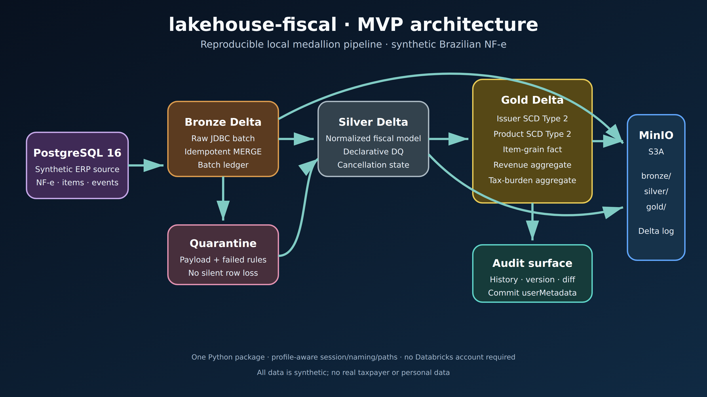

# lakehouse-fiscal

[](https://github.com/rubensrudio/lakehouse-fiscal/actions/workflows/ci.yml)

A locally reproducible medallion lakehouse for synthetic Brazilian NF-e data. It demonstrates
idempotent Delta Lake ingestion, data quality with quarantine, cancellation-aware fiscal
transformations, reusable SCD Type 2 dimensions, point-in-time fact joins, analytics and time
travel without requiring a Databricks account.

All data is 100% synthetic. It contains no personal data and has no relationship with any real
taxpayer, company or invoice.

## What it demonstrates



- Spark 3.5.3, Delta Lake 3.2.1, Java 17 and Python 3.11, version-pinned.
- PostgreSQL 16 as the source ERP and MinIO as S3-compatible object storage.
- A fixed seed produces 5,000 invoices, 50,000 items, 300 issuers, 1,000 products and 200
  cancellation events at scale 1.
- Every managed Delta commit receives `batch_id` and `stage` user metadata.
- Silver rejects invalid fiscal rows into an auditable quarantine instead of silently dropping
  them.
- Gold resolves issuer and product surrogate keys as of the invoice issue time.

## Run locally

Requirements: Docker with Compose, `uv`, 4 CPU and 8 GB RAM. The first bootstrap pulls images and
builds the pinned Spark image, so its duration depends on local cache and download bandwidth.

```bash
cp .env.example .env
make bootstrap
make seed
make run-all
make verify
```

Run `make run-all` a second time to observe the idempotent merge counters: unchanged source rows
produce zero inserts and zero updates. Tear down all containers and volumes with:

```bash
make teardown
```

The commands support macOS and Linux. On Windows, use WSL2 with Docker integration.

## Useful commands

```bash
make help
make lint
make test-unit
make test-integration
make test
make run-bronze
make run-silver
make run-gold
make sql FILE=sql/analytics/01_faturamento_mensal_uf.sql
```

## Data quality and auditability

Rules have `warn`, `drop`, or `fail` severity. Warning rows continue with `_dq_status=WARN`;
drop rows go to `silver.quarantine_nfe`; fail rules abort before any write. The audit notebook
[`notebooks/03_time_travel_audit.py`](notebooks/03_time_travel_audit.py) reconstructs a past gold
revenue version and compares it with the current version.

The local catalog emulates three-level Unity Catalog names as `catalog_schema.table`. It does
not emulate grant enforcement, lineage capture, or audit logging. This distinction is
intentional and avoids overstating local governance.

## Measured results

Measured locally on 2026-09-16 with Colima limited to 4 CPU and 8 GB RAM, using the scale-1 seed:

| Measurement | Observed result |
|---|---:|
| Full medallion run | 36.08 s |
| Bronze ingestion | 55,500 rows in 13.61 s (4,076 rows/s) |
| Silver output | 55,200 rows |
| Gold item fact | 50,000 rows |
| Quarantined rows in the valid seed | 0 |
| Second run | 0 Bronze, 0 Silver and 0 Gold inserts/updates |
| Test coverage | 83.07% global |
| Critical-module coverage | transforms 100%, SCD2 98.59%, expectations 98.39% |

The cold image-pull time is intentionally omitted because it was not measured from a cache-free
machine. `make verify` was also executed in a fresh Spark process, proving that catalog metadata
and Delta data remain available across sessions.

## Roadmap after the MVP

- Wave A: Auto Loader XML/event ingestion and PostgreSQL CDC.
- Wave B: OPTIMIZE/Z-ORDER/VACUUM measurements and Change Data Feed refresh.
- Wave C: Databricks Asset Bundles, Unity Catalog artefacts, lineage and Lakeflow Declarative
  Pipelines.

Databricks deployment has not been executed against a workspace. The MVP is local-only by design;
the roadmap items remain planned increments rather than partially verified claims.

## License

MIT.
